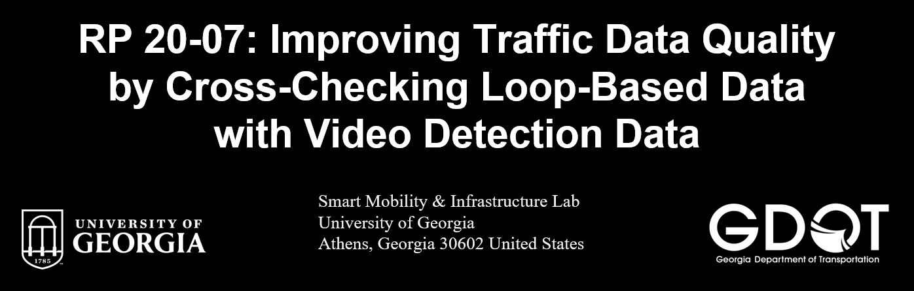
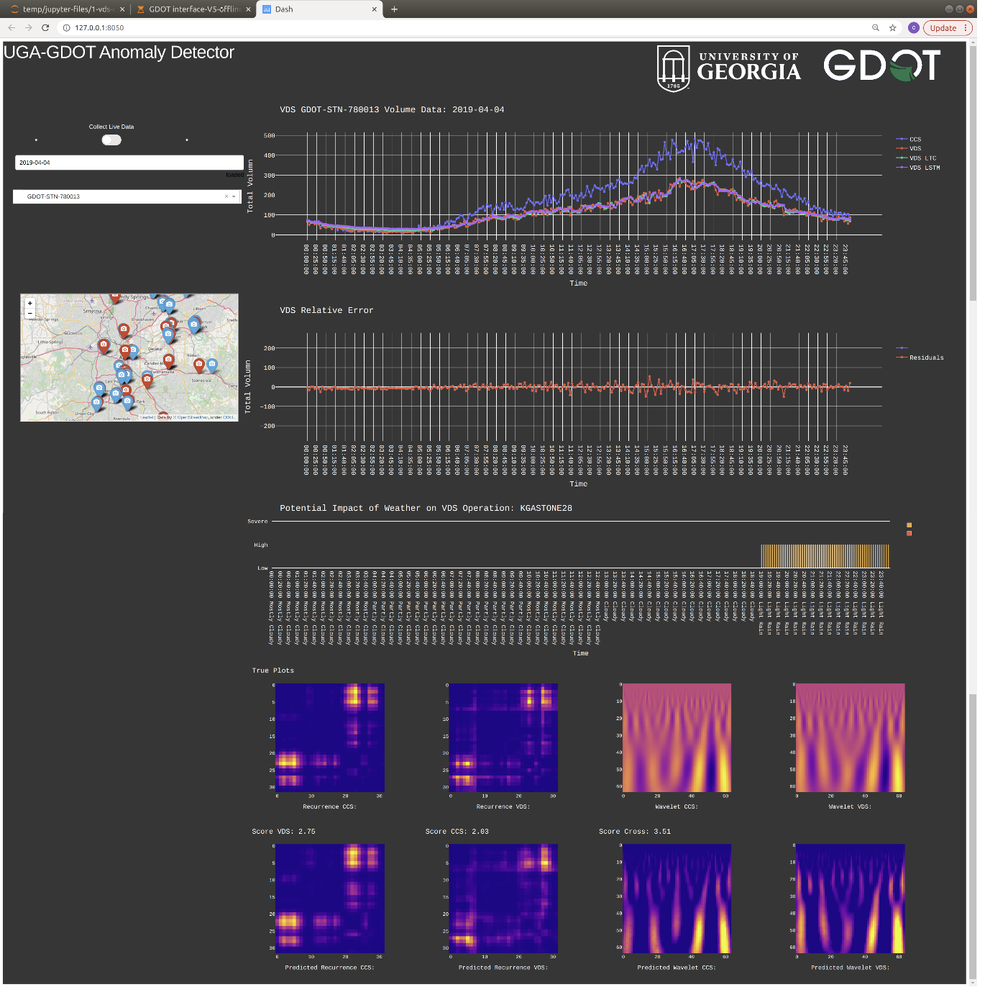

# GDOT-RP20-07



## Background
A detailed explanation of the project be found [here](https://drive.google.com/file/d/1_WYg_vVzuz3DLocraJGjaargyCZ7Jt9d/view?usp=sharing).

### Model Architecture 


## Set up
### Step 1:
Install all required packages by typing the following command into the terminal:
```
pip install -r requirements.txt
```
### Step 2:
Download a [chrome driver](https://chromedriver.chromium.org/downloads) matching your version of chrome. Place the driver in the repo folder.
### Step 3:
Download historical [CCS-VDS data](https://drive.google.com/file/d/1sJVT0Z2HbnMA9soFFfnMJ-le_DcM-tJc/view?usp=sharing).
### Step 4:
Download model [weights](https://drive.google.com/file/d/18u6rr26MY4-Jcd1UCuFdRPNEiCE8Wzi7/view?usp=sharing).
### Step 5:
Launch app by running the following command.
```
python app.py
```
### Step 6:
Select the URL that appears in the terminal to open the dashboard.


## Application Demo


